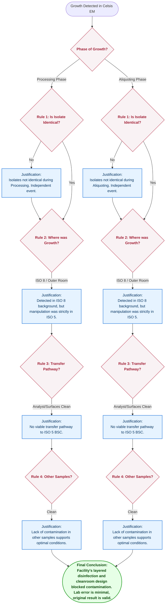
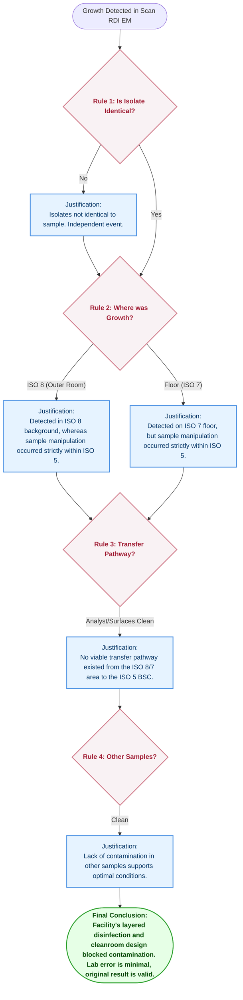
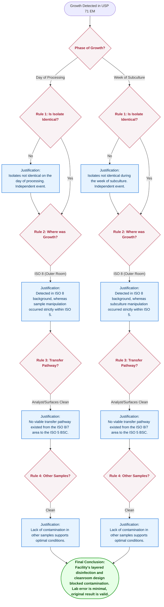

# OOS EM Growth Justification Flowcharts by Test Method (Updated)

Based on our final, bulletproof logic, the **Core Logic Engine** applies a 4-step shielding mechanism. What changes between the 3 tests is the **Phasing** (the timeline of when the sample was exposed). The updated decision trees below map out the ultimate defense logic.

---

## 1. Celsis Decision Tree (Two-Phase Exposure)
Celsis explicitly involves **Processing** and **Aliquoting** phases. 

---

## 2. Scan RDI Decision Tree (Single-Phase Exposure)
Scan RDI has a single **Processing** event. The logic heavily relies on the physical separation between ISO 8 and ISO 5.

---

## 3. USP <71> Decision Tree (Processing + Subculture)
USP <71> introduces a **Subculture / Day 14+** phase. The justification must distinguish whether the growth happened on the "day of processing" or "during the week of subculture".

